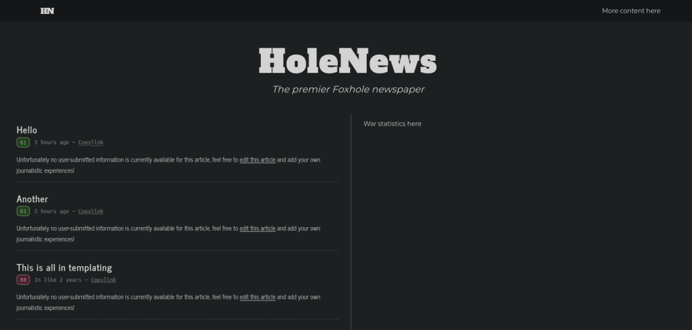
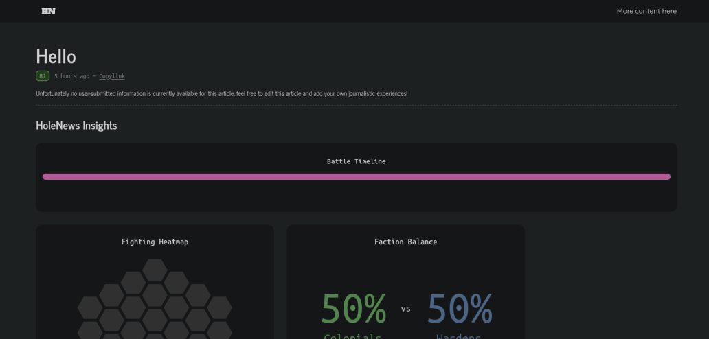

# HoleNews

Automated reporting and wiki website for the [Foxhole](https://store.steampowered.com/app/505460/Foxhole/) game

## Showcase

Some screenshots displaying the current state of the HoleNews frontend:




## Running

First, please install [`sqlx-cli`](https://crates.io/crates/sqlx-cli) and run the migrations as such:

```shell
cargo install sqlx-cli --no-default-features --features sqlite
sqlx database create
sqlx migrate run
```

Then, once you have installed Rust, launch an instance with the following command:

```shell
cargo run
```

Now all that's left is optional [configuration](#configuration) and then you can move your binary and database to whatever location is most suitable! 😊

## Configuration

The following environment variables may be changed in order to configure an instance:

```env
DATABASE_URL=sqlite://holenews.db
LOG_TRACE=yes
```
